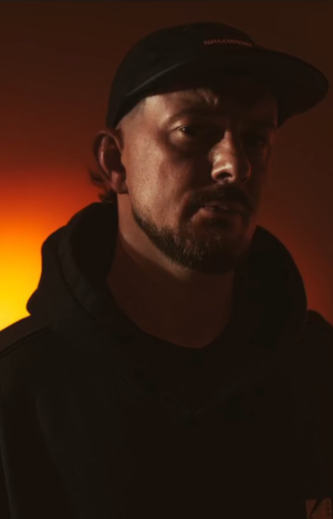

# A.RES

Lille, France · Minimal / Micro house · 120–130 BPM

---

## Bio courte

A.RES joue depuis 2019. Il digge en vinyle et construit ses sets sur des boucles longues,
entre 120 et 130 BPM : minimal, micro house. Basé à Lille, il fait partie du collectif
Parallel Universe et joue en formats de 1h30 à six heures.

## Bio longue

A.RES joue depuis 2019, à Lille. Minimal et micro house, entre 120 et 130 BPM.

Le set se construit sur des boucles longues : les éléments entrent et sortent un par un,
la tension monte par accumulation plutôt que par rupture, et un même motif peut tenir
plusieurs minutes avant de se déplacer. C'est une écriture qui demande de la durée — d'où
les formats de 1h30 à six heures — et une matière première large, qu'il va chercher en
diggant du vinyle.

Il fait partie du collectif lillois Parallel Universe. Deux mixes en ligne en 2025, dont un
b2b avec UNKNOW.

---

## Formats de set

| Format | Durée | Setup | Note |
|---|---|---|---|
| DJ set | 1h30 – 3h | 4 CDJ + DJM | Format standard |
| Extended | 4h – 6h | 4 CDJ + DJM | Sur demande |
| B2B | 2h – 4h | 4 CDJ + DJM | Avec UNKNOW, ou ouvert |

## Repères

| | |
|---|---|
| Base | Lille, France |
| Actif depuis | 2019 |
| Style | Minimal, micro house |
| Tempo | 120–130 BPM |
| Collectif | Parallel Universe |
| Territoire | Europe |

---

## Mixes

- **A.RES — micro halloween** — 2025 · 54 min · [SoundCloud](https://soundcloud.com/dorian-moreau-453577433/a-res-micro-halloween)
- **A.RES B2B UNKNOW (JSW)** — 2025 · 59 min · [SoundCloud](https://soundcloud.com/dorian-moreau-453577433/ares-b2b-unknow-jsw)

<!-- Sorties, dates marquantes et presse : sections retirées tant qu'il n'y a rien de réel
     à y mettre. Un presskit d'une page dense vaut mieux qu'un presskit à moitié rempli.
     On les rouvre après les premières dates. -->

---

## Liens

- **Instagram** — [@a.res_music](https://www.instagram.com/a.res_music/)
- **SoundCloud** — [dorian-moreau-453577433](https://soundcloud.com/dorian-moreau-453577433)

## Contact

**Booking** — Dorian Moreau, dorian.moreau056@gmail.com
**Territoire** — Europe

---

## Ressources

- Photos HD, libres de droits pour la promotion, crédit obligatoire
- Fiche technique — `TECHNICAL-RIDER.md`
- Ce presskit en PDF — `presskit.pdf`

---

*Presskit mis à jour le 4 septembre 2026. Merci de ne pas recadrer les visuels ni retirer les crédits.*
